# Football Machine Learning Project: (Data Science Professional Practice)

## Executive Summary
Historically, football predcitions have relied on subjective analysis by journalists and pundits, but recently more and more studies have incorporated Machine Learning algorithms to predict match outcomes and final standings of leagues and tournaments.

This study utilises match-level data sourced from ["Footballdata.co.uk"](https://www.football-data.co.uk/) to assess which mid-season features best predict final points, using a OLS linear regression model.

Linear regression was chosen as a suitable model as all 5 features were continuous, as well as the target variable final points, compared to classification models such as logistic regression which are used to predict binary outcomes.

After selecting 5-midseason features and conducting hyperparameter tuning, Ridge regression was found to be the best model for predicting points, though the difference between models was not material.

### Looking forward
Future model development would benefit from including more advanced football statistics such as expected goals **(XG)**, which may enhance predictive power of the model. 
<!-- This is a comment -->

## Data Preprocessing
Data was extracted for Premier League Seasons **2015/16 to 2024/25** using the `pd.read_csv()` function and then concatenated into a single dataframe using `pd.concat()`.
Column consistency checks were performed to ensure that there would not be two columns that meant the same thing after concatenation. 

The `len()` method was then utilised to ensure each season had 380 rows (The number of games in a premier league season).

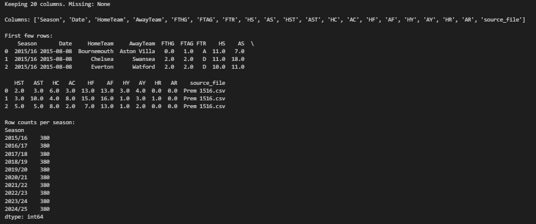 

### Building Team centric table
The dataframe was then transformed into a team-centric format, creating two dataframes using `pd.DataFrame` one for home and one for away. A dictionary was used to map points (3 for a win , 1 for a draw and 0 for a loss) and columns were renamed to reduce ambguity.
Below is an example of the away-centric dataframe, but thr same methodology was applied to create the home one.
```python
away_pts_map = {"A": 3, "D": 1, "H": 0}
```
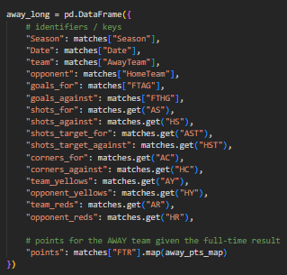 

Match numbers were then assigned so the data could be filtered to 19 matches played (midseason) using a `pd.groupby().cumcount() +1`.
The dataframe was then filtered to 19 matches played and midseason statistics were calculated using a `pd.groupby().agg('sum')`. Sanity checks were conducted to ensure there were 38 games per team per season.

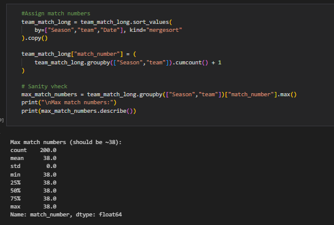 

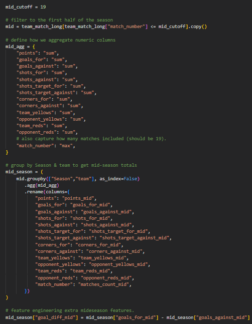 

### Feature engineering
Additional features were engineered such as goal difference (Goals Scored - Goals Conceded) and a form index, which calculated a teams form on a scale of 0-1 based off of its last 5 fixtures. 

```python
# filter to first half of the season
mid_matches = team_match_long[team_match_long["match_number"] <= 19].copy()

# define function to calculate form (sum of last 5 games points / 15)
def form_last5(x):
    last5 = x.sort_values("match_number").tail(5)
    return last5["points"].sum() / 15  

# apply per Season–Team group
form_df = (
    mid_matches.groupby(["Season","team"])
               .apply(form_last5)
               .reset_index(name="form_index_mid")
)

# merge with mid_results 
mid_results = mid_results.merge(form_df, on=["Season","team"], how="left")
```
The data was then ready for EDA.
## EDA and Feature Selection
Histogram plots were used to assess the distribution of mid-season features and ensure their validity.

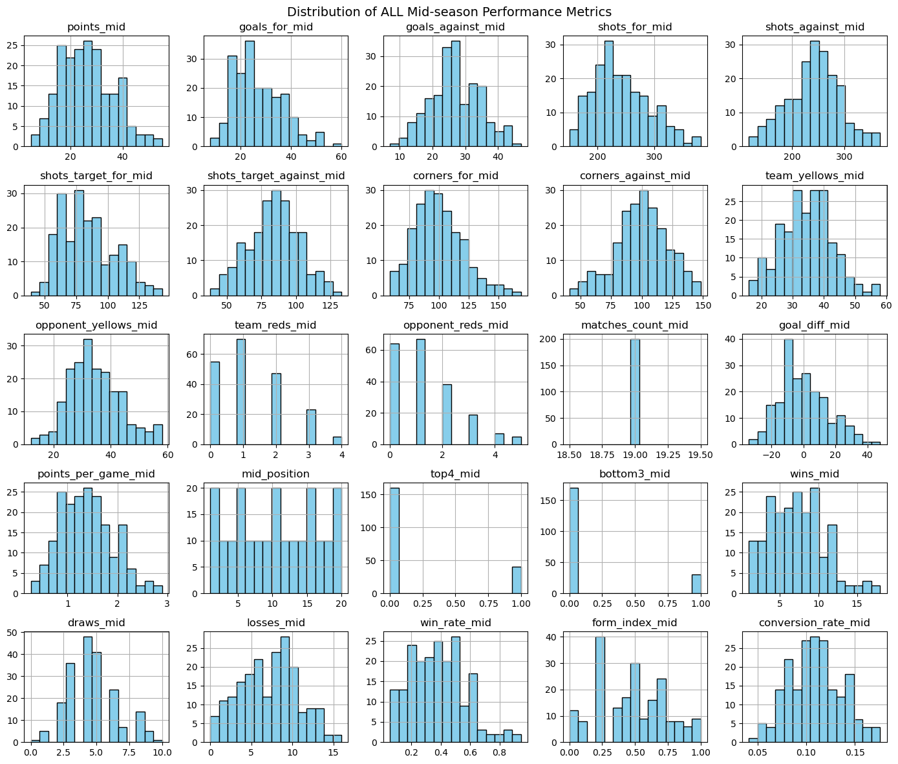 

Whilst a correlation barplot was used to assess which features most strongly correlated with final points. Correlation between features was also assessed to reduce the implications of multicollinearity and remove redundant features that were too highly correlated to eachother that would have led to overfitting.

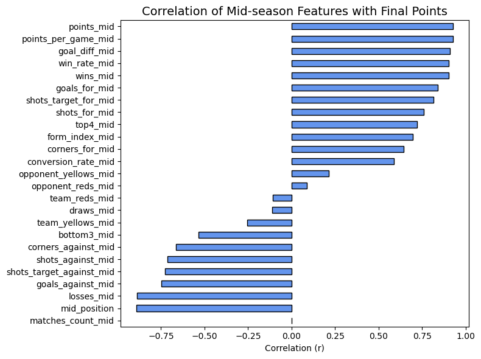 

### This lead to the selection of the final machine learning ready model dataframe:

**Features:** **points_mid, goal_diff_mid, shots_target_mid, goals_against_mid, form_index**.

**Target Variable:** **Final Points**

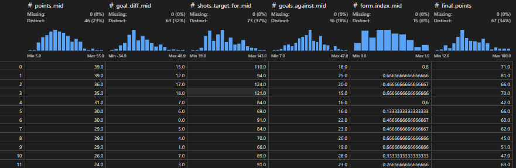 


## Machine Learning

### Train and test split
The model was then split using sci-kitlearn. Of the 200 rows in the dataftame (10 seasons, 20 teams), **80%  was allocated for training and 20% for testing**.

A specific random seed was chosen for reproducability.

```python
#Splitting into X and Y (features and target)
x = model_df[feature_cols]
y = model_df[target_col]
from sklearn.model_selection import train_test_split
from sklearn.linear_model import LinearRegression

#train test split
x_train, x_test, y_train, y_test = train_test_split( x, y, test_size=0.2, random_state=1234)
print("Train size:", x_train.shape[0], "rows")
print("Test size:", x_test.shape[0], "rows")
```
### Fitting on training data
```python
#Creating and fitting the model
lin_reg = LinearRegression()
lin_reg.fit(x_train, y_train)

print("\nLinear Regression model fitted.")
```

### Predicting final points and obtaining key metrics
The following metrics were used to assess model performance:
**Adjusted R-squared:** Measures how much of the variance in final points is explained by the model and penalises the inclusion of unecessary variables.

**Root Mean Squared Error**: Answers on average how many points are the models prediction wrong by?

**Mean absolute error**: Measures the absolute difference between predicted and final points. A key difference to RMSE is that it treats differences equally, meaning its not as influence by outliers.


```python
#Predictions
y_train_pred = lin_reg.predict(x_train)
y_test_pred = lin_reg.predict(x_test)

#Rsquared Score
r2_train = r2_score(y_train, y_train_pred)
r2_test = r2_score(y_test, y_test_pred)

# Errors
mae_test = mean_absolute_error(y_test, y_test_pred)
rmse_test = np.sqrt(mean_squared_error(y_test, y_test_pred))

print(f"Training R-Squared: {r2_train:.3f}")
print(f"Test R-Squared:     {r2_test:.3f}")
print(f"Test MAE:    {mae_test:.2f} points")
print(f"Test RMSE:   {rmse_test:.2f} points")
```

### Obtaining Coefficients
Regression coefficients were calculated as they allow model interpretation of how each mid-season feature impacts final points.
```python
coef_df = pd.DataFrame({
    "feature": feature_cols,
    "coefficient": lin_reg.coef_
}).sort_values(by="coefficient", ascending=False)
```


## Results
The regression coefficients for the base OLS linear regression model can be seen below. Form index appears as if it's the largest predictor but that is not the case. Form index was scaled 0-1. So in reality a team with a perfect form index are predicted to finish 3 points higher than a team with a 0 form index if everything else was equal.

Mid-season points was the biggest predictor, as for every midseason point gained, final points are expected to increase by 1.06.
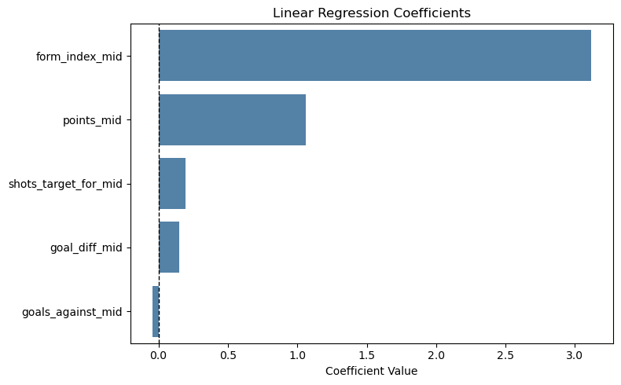 

### Actual Vs Predicted Plot
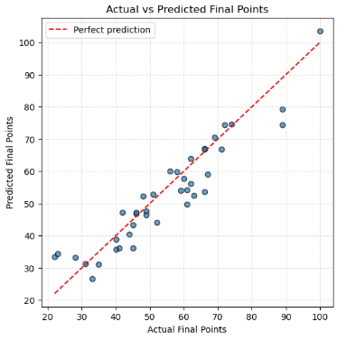 


### Comparing Algorithms and Metrics
Alternative regression models were explored. These included ridge and lasso regression which use regularisation techniques to prevent overfitting through either shrinking coefficients or removing features from models. Elastic Net, a combination of the two was also explored, as was Random Forest Regressor, an ensemble method.

GridSearchCV() was also used to find the optimal parameters for these models.

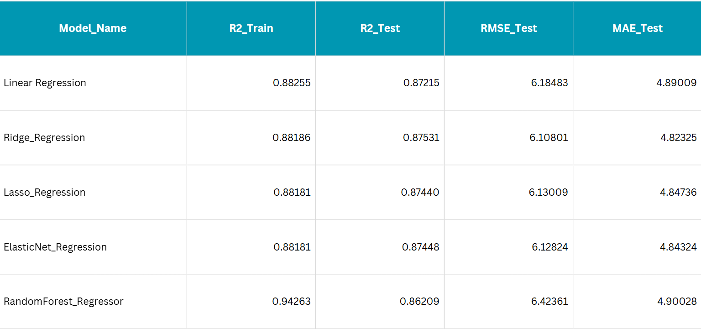 

 In terms of model performance, Ridge regression marginally outperformed outher models, however the differences are not material. Random Forest showed signs of overfitting with a big discrepancy between train and test Adjusted R-Squared scores, indicating it did not generalise aswell as the other models to unseen data.

 The original regression models score of **0.87** indicates the model explains 87% of the variance in final points. MAE and RMSE scores illustrate that on average, the model predictions are  **+/- 4.9 and 6.2** points out from actual final points. A higher RMSE than MAE suggests the model struggles with certain outliers when predicting final points.


 ## Final Remarks
 Overall, the 5 features selected and metric scores illustrate that the model is a good starting point predicting premier league final points based off of mid-season features.

 Future development of the model would be to use unseen 25/26 premier league data at **19 matches played**, and assess at the end of the season how accurately wthe model predicts each teams final points and subsequently final position.


 ## Bonus
 An iteration of the model was developed, holding out the 24/25 season as test data and training on all prior seasons to see how well the model would predict final points and position based on the 5 selected features. Whilst model performance dropped to a 0.8 adjusted R-Squared score, it was still able to predict **3 out of the top 4** correctly and **all 3 relegated teams** with a Mean absolute position error of **2.1 positions**.

 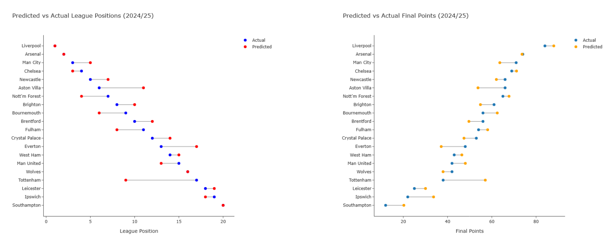 


